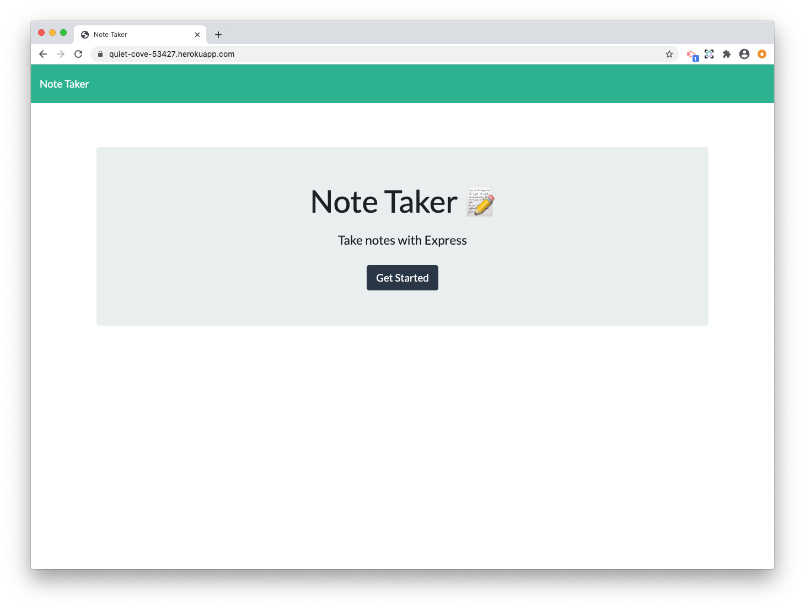
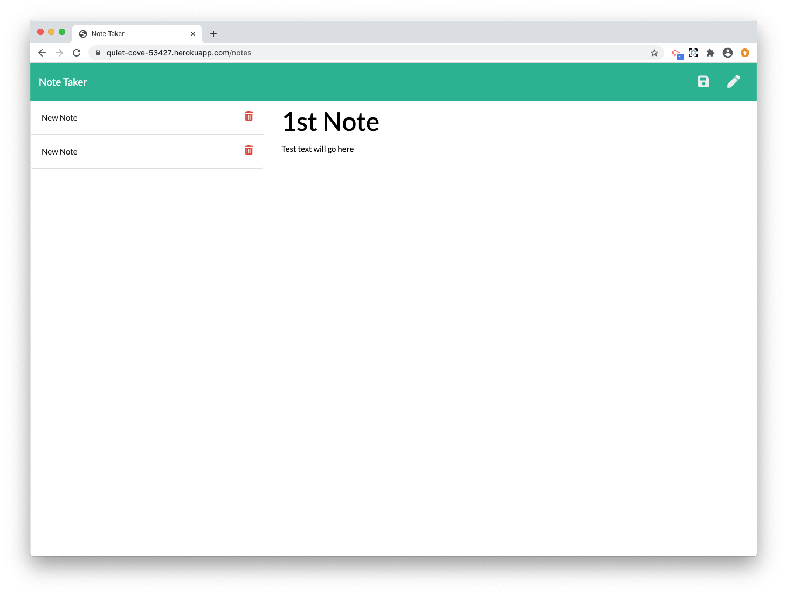
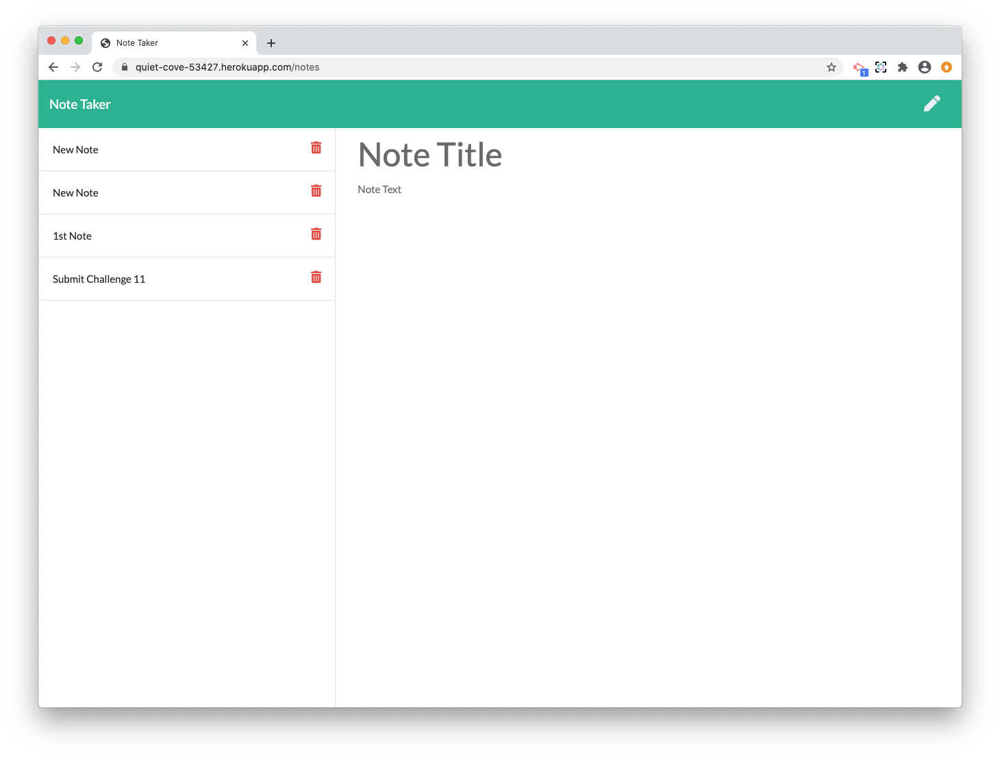
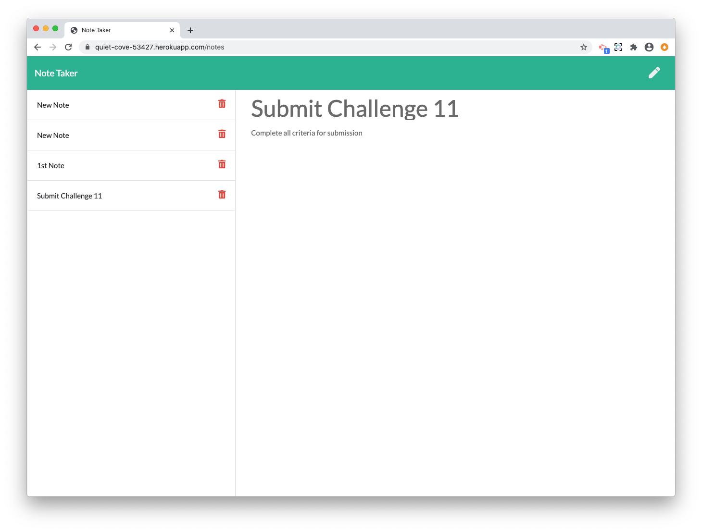
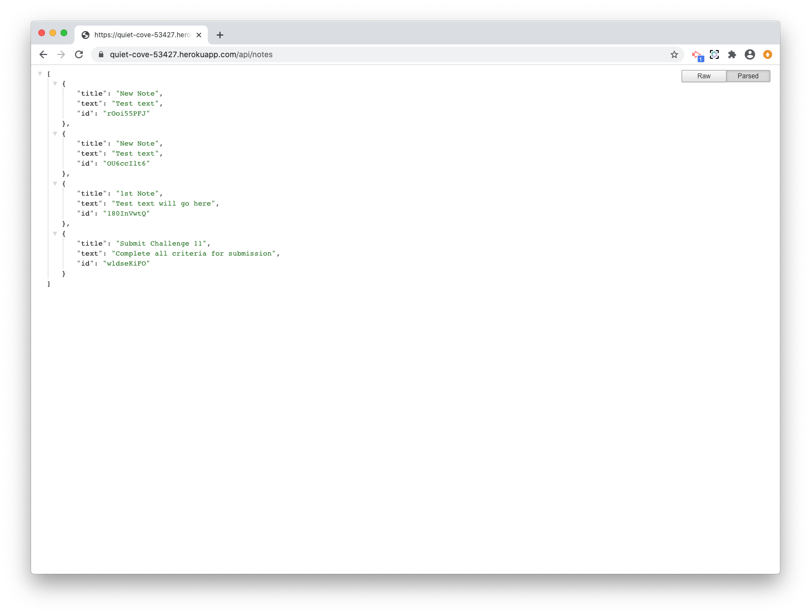

[](https://opensource.org/licenses/MIT)

# Note Taker

## Created by:

### Nikita Pokamestov

## License

Note Taker is licensed under the

[](https://opensource.org/licenses/MIT)

MIT License

A short and simple permissive license with conditions only requiring preservation of copyright and license notices. Licensed works, modifications, and larger works may be distributed under different terms and without source code.
Permissions | Limitations  |   Conditions
------------ | ------------  | ------------
Commercial use | Liability |   License and copyright notice
Modification | Warranty    |
Distribution |     |
Private use |     |

## Description

Express.js Note Taking App used to have the ability to take notes and save them on a server rather than on a local device.

## Table of Contents

* [Installation](#installation)

* [Usage](#usage)

* [Contributing](#contributing)

* [Tests](#tests)

* [Links](#links)

* [Screenshots](#Screenshots)

* [Questions](#questions)

## Installation

To Install necessary dependencies, run the following commands:  

```
git clone git@github.com:npokamestov/note-taker.git
```
```
npm init
```
```
npm i
```
```
npm install express
```
```
npm install shortid
```
```
npm install -g heroku
```
```
heroku create
```


## Usage
```
npm start	//starts running the server
```

## Contributing

If you want to know about contributing to the repo:

Nikita Pokamestov - GitHub Repo: [note-taker](https://github.com/npokamestov/note-taker)

## Tests

To run the tests, run the following command:

```
n/a
```

## Links 

* Deployed Application:
    - [https://quiet-cove-53427.herokuapp.com/](https://quiet-cove-53427.herokuapp.com/)
* GitHub Repository:
    - [https://github.com/npokamestov/note-taker](https://github.com/npokamestov/note-taker)

## Screenshots
### Screenshot 1


### Screenshot 2


### Screenshot 3


### Screenshot 4


### Screenshot 5


## Questions?

If there are any questioins please refer to this email or leave a comment in the repository

Email: npokamestov@yahoo.com

Github Website: https://github.com/npokamestov/
